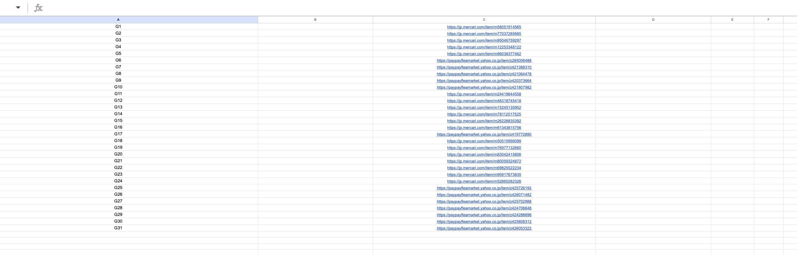
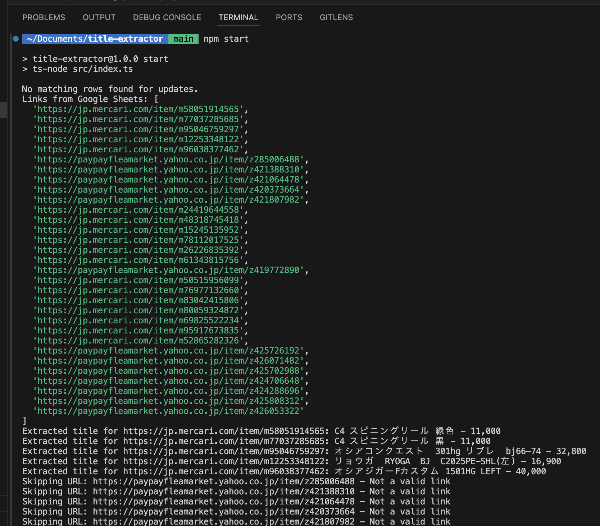
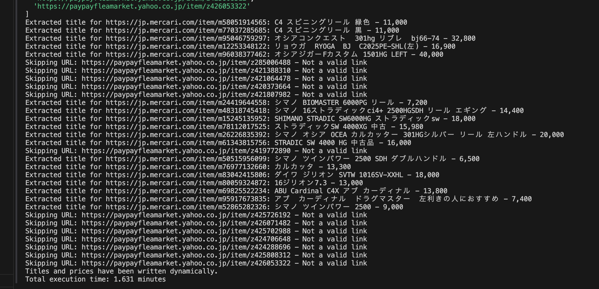
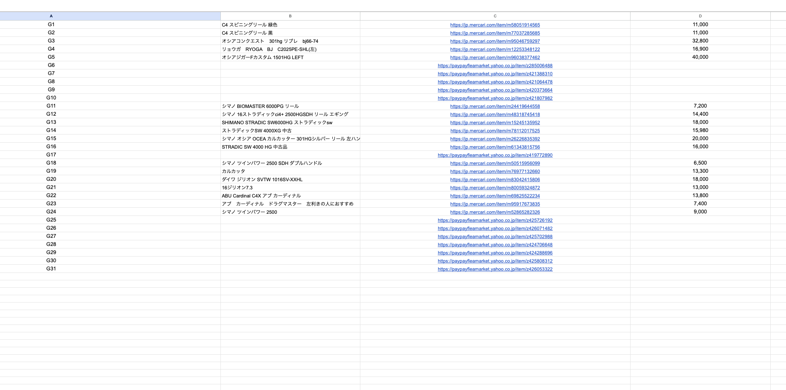

## 📘 Example Flow: How the Script Works

### 1. Initial Input from Google Sheet

This is the sample data containing product links. The script will extract the corresponding **title** and **price** for each.



---

### 2. Run the Script

Execute the following command to start the script:

```
npm start
```

Below are examples of how the data is fetched and processed:

<br><br>


### 3. Output Result

Here’s the result of the script. (Note: Some links may fail due to dynamic HTML rendering. Improvements will be added in version 2.)


